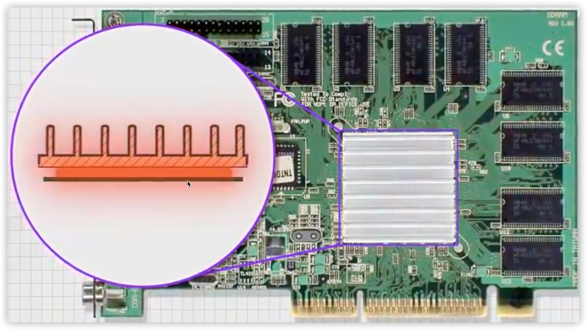

# 历史

- 1997年, NVIDIA Riva 128显卡
  - 性能较低, 发热较低, 自然散热
- 1998年, NVIDIA Riva TNT显卡
  - 性能功耗提升, 铝制散热片, 纯被动散热

  - 铝片工艺
    - 挤铝工艺: 一大片铝块高温挤压塑型
    - 铸造工艺
    - 铲齿工艺
    - 切削工艺
- 1999年, NVIDIA GeForce 256
  - 正式提出了GPU概念
  - 铝片 + 4厘米风扇, 主动散热
- 
- 热管+鳍片+风扇
  - 热管(HEAT PIPE)
    - 中空的铜管
    - 内部填充相变冷却液
    - 管子内部是烧结壁, 便于液体蒸发, 到冷区冷凝通过毛细现象返回热区
    - 主流的热管规格是6mm 或 8mm
      - 热承载能力相差将近一倍

    - 热管数量
      - 通常越多越好, 但是有边际效应
    - 鳍片
      - 热管与鳍片接触方式: 

# Refs
- [全网最详细显卡散热工作原理科普](https://www.zhihu.com/zvideo/1433777767221071872)
