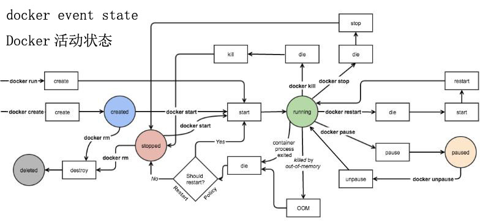

# 总结
1. 在Linux上的Docker, 本质上是使用了
   1. `cgroups`: 本质上是Linux内核提供的资源Quota约束机制, 包括cpu/mem/io等
   2. `namespace`: [命名空间](https://yeasy.gitbook.io/docker_practice/underly/namespace), 包括pid, net, ipc, mnt(文件目录root), uts, user(即username, group等)  
   3. `UnionFS`: 是 Docker 镜像的基础。镜像可以通过分层来进行继承，基于基础镜像（没有父镜像），可以制作各种具体的应用镜像。
2. Running/Stopped的容器, 其镜像是不能被删除的(除非强制删除). 启动容器的时候, 需要重新使用镜像作为模板.


# 疑问与思考
1. Docker容器中的多个进程, 在Host上看起来是怎样的? 
2. Docker镜像在Host上存放的路径是哪里?
   1. MacOS: `~/Library/Containers/com.docker.docker/Data/vms/0/`
3. Docker容器的生命周期是怎样的? 为啥Stop之后还需要Remove掉? 如果不Remove, 会怎样?

# 常用命令
## 容器
容器生命周期
--- 


容器命令
---
* 使用镜像创建容器
  * v: 挂载volume
  * 
```shell
docker create -p 3000:3000 --name <the-container-id> <the-image-id>
docker create -p 3000:3000 -v <the-volume-id>:<mount-point> --name <the-container-id> <the-image-id>
```

* 查看运行的容器
    * 查看运行中的容器
```shell
docker ps
CONTAINER ID   IMAGE                    COMMAND                  CREATED         STATUS         PORTS                                       NAMES
d2c016a1e2ab   getting-started          "docker-entrypoint.s…"   2 minutes ago   Up 2 minutes   0.0.0.0:3000->3000/tcp, :::3000->3000/tcp   confident_bouman
```
    * 查看所有容器(包括Stopped)
```shell
docker ps -a
docker container ls -a
```
    * 查看容器Command完整列表
```shell
docker ps --no-trunc
```

    * 查看容器详情
```shell
docker inspect <the-container-id>
```

* 登录容器
  * -i, --interactive 保持STDIN打开，即使没有连接
  * -t, --tty 分配一个pseudo-TTY
```shell
docker exec -it <the-container-id> /bin/sh
docker exec -it <the-container-id> /bin/bash
```


* 启动容器

```shell
docker start <the-container-id>
```


* 使用镜像创建&启动容器
  * -d - run the container in detached mode (in the background)
  * -p 80:80 - map port 80 of the host to port 80 in the container
```shell
docker run -dp 3000:3000 <the-image-id>
```

* 停止容器
```shell
docker stop <the-container-id>
```

* 删除容器
```shell
docker rm <the-container-id>
```

* 使用容器创建快照/镜像
```shell
docker commit <the-container-id> <the-image-id>
docker commit <the-container-id> <your-docker-namespace>/<the-image-id>
```


## 镜像
* 通过源文件Dockerfile构建镜像
  * -t: tag image
  * . : tells that Docker should look for the Dockerfile in the current directory
```shell
docker build -t getting-started .
```


* 查看镜像列表

```shell
docker image ls
REPOSITORY               TAG       IMAGE ID       CREATED       SIZE
getting-started          latest    79b4eb26b9f4   4 hours ago   404MB
```

* 把镜像push到hub
```shell
docker tag <the-image-id> <your-docker-namespace>/<the-image-id>
docker push <your-docker-namespace>/<the-image-id>
```


* 通过源文件Dockerfile构建镜像

* 检查镜像内容

```shell
docker inspect <the-image-id>
```

* 查看镜像继承关系
* 查看镜像历史版本


## volume

* 创建
```shell
docker volume create
```

* 查看列表
```shell
docker volume ls
```

* 查看详情 
  * Mountpoint: 代表在Host上的实际路径, 但实际在mac上由于是虚拟机, 因此并不准确
```shell
docker volume inspect <volume-name>
```

# Refs
- [容器核心:cgroups](https://www.jianshu.com/p/052e3d5792ee)
- [Docker-从入门到实践](https://yeasy.gitbook.io/docker_practice/underly/ufs)